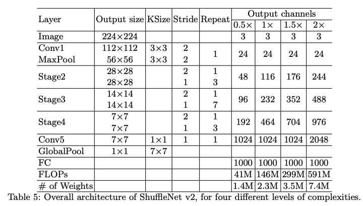

# HYU_Capstone

Our goal is to achieve the real-time (high fps) and better IDF1 score on MOT task, and try to deploy on the mobile devices or embedding devices. 

In the actual project, it is often required to deploy on the ARM's devices which the CPU-only environment. Therefore, we decided to design the lightweight real-time multi-object tracking architecture. 

 

The first lightweight architecture that come to mind are shufflenet and peleenet. They all achieved the real time on the ARM's platform. 

the hardware platform 

The multiple object tracking 

The real-time tracking is very important in the actual projects. 

In the actual project such as license plate recognition, the task depends on the detection each frame. Success or not of object detection will affect the success of license plate recognition. It is hard to recognize the

## Backbone(shufflenet) architecture

## Shufflenet v2 1.5x + FPN

## Demo

## Goal

To get better IDF1/ID-switch score on MOT task, and try to deploy on the mobile phone or embedding device.

## Idea

The MOT task is a kind of object-ness detection, most of MOT task that detect only human or car in the processing of detection, not pay more attention on detail class of object. Thus, we plan to design a light-head object detection network first. Then merge the moving track(or motion patterns) with features of object to match similarity.

### Detail

#### Light-head

We chosen anchor-free network that centerNet, in centerNet paper that using ResNet-18 as backbone, but ResNet series is not friendly to deploy on mobile device, model size of ResNet series is too big to deploy.

In addition, MOT task is not need to care the small objects, so we decide to using large receptive field.

## Progress

We choosen Lite-HRNet as backbone at beginning but we had a try on that, it is a new one and difficult to us.

Then, we choosen shuffleNetV2 as backbone now and reappear it via Keras.

* try on reappear Lite-HRNet but failed
* reappear the shuffleNet v2 via Keras
* reappear the centerNet via Keras
* large-RF shuffleNet 3x3 -> 5x5
* centerNet train script (in processing)
* modify the head of centerNet (in processing)
    * Conv2D 3x3 -> DepthwiseConv2D 5x5
    * refer to block of shuffleNet

## Reference

* [FairMOT](references/FairMOT.pdf)

* [centerNet](references\CenterNet.pdf)

* [shuffleNetV2](references/shuffleNetV2.pdf)

