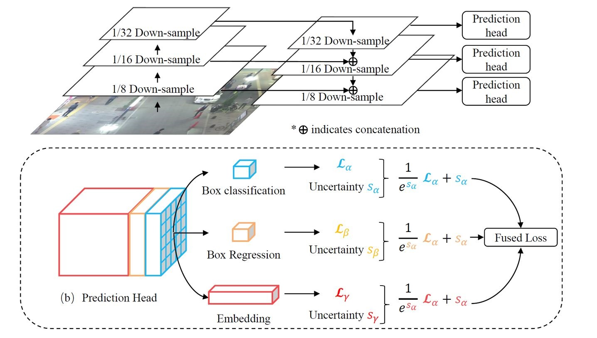
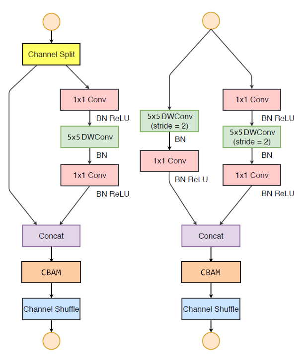
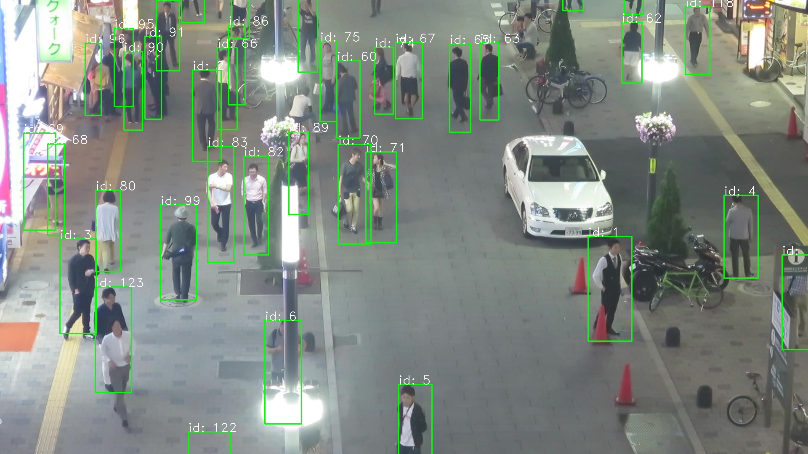
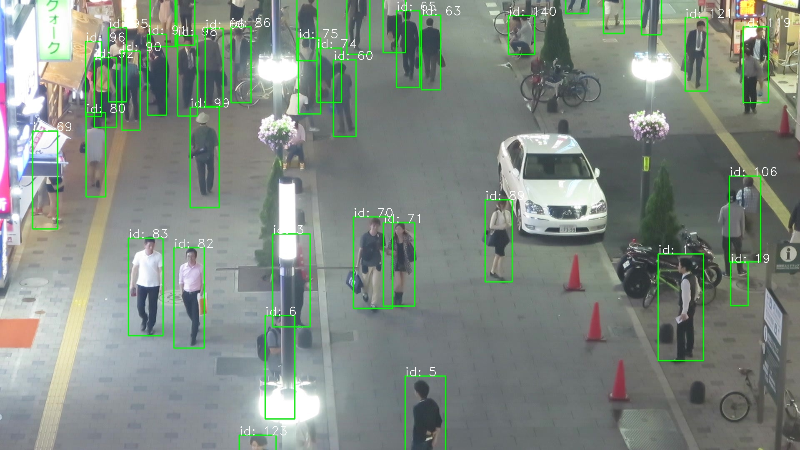
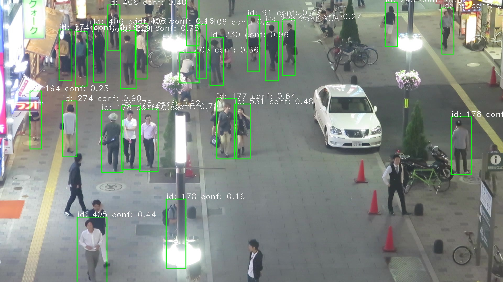
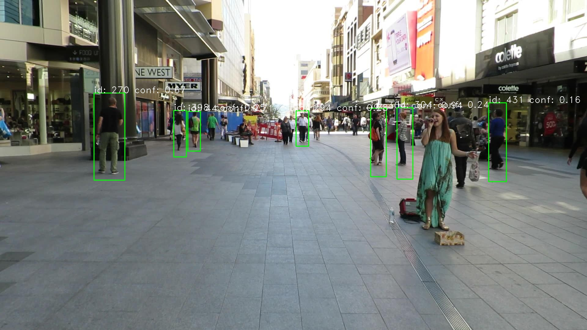

# HYU_Capstone

> ZHANG HAOYU, student ID: 2018000337
>
> GitHub Link: https://github.com/noahzhy/HYU_Capstone

## Introduction

The goal of this project is to achieve the real-time (high fps) and better IDF1 score on MOT task, and try to deploy on the mobile devices.

In the actual project, it is usually required to deploy on the devices which the CPU-only environment. Therefore, I decided to design the lightweight real-time single stage multi-object tracking architecture.

## ShuffleTrack Architecture

The traditional multi object detection is using the object detection with tracking model such as yolo with deepsort. This mode (tracking by detection) is dependence on detector, and also it is not friendly to deploy on real devices. Another mode that SDE (separate detection and embedding) is too slow to deploy because the object detection and appearance feature extraction are separated. Thus, JDE (jointly learns the detector and embedding) mode is proposed and it is easy to deploy on devices. The first time of JDE is proposed in paper [Towards Real-Time Multi-Object Tracking](https://arxiv.org/abs/1909.12605), the original model in this paper is as follows.

In above paper, the backbone is used by ResNet series, the computation of that is very huge for mobile devices. Therefore, I replaced the backbone and did a little modification on it. In original paper, the JDE mode only output the detection boxes and embedding features at same time for each detected object. And then it also needs to use Kalman filtering and Hungarian algorithm for matching the objects. The idea of JDE is great but Kalman filtering is not reliable for objects with sudden changes in motion. In addition, I would like to output the detected boxes with IDs directly without subsequent tracking steps. In combination with the above questions, I propose some improvements which called shuffletrack. 

The shuffletrack architecture is as follows.

## Improvement

### Backbone

The first lightweight backbone that come to mind is shufflenet. It's every common lightweight architecture for mobile devices. Thus, I choose the shufflenet v2 1.5x as backbone because that it could achieve the high accuracy with less operations. In shufflenet, the 5x5 depth-wise convolution obtains twice the receptive field, with a little increase in computation over the 3x3 depth-wise convolution. Therefore, I replace all the depth-wise convolutions in ShuffleNetV2 with 5x5 convolutions to get large receptive field.

|  |  |
| :------------------------------------------------------------: | :--------------------------------------------------------: |
| Two 3x3 depth-wise conv with 32 channels                     | Single 5x5 depth-wise conv with 32 channels              |
| $(3\times3\times32+32\times32)\times2=2624$                  | $5\times5\times32+32\times32=1824$                       |

In addition, I added CBAM module in the two basic unit of shufflenet blocks to get effective feature refinement. The reason of choose CBAM module is that overall overhead of CBAM is quite small in terms of both parameters and computation. CBAM is quite suitable to the light-weight network, 

The two basic unit of shufflenet after modification are as follows.

|                       Original blocks                        |                     Modification blocks                      |
| :----------------------------------------------------------: | :----------------------------------------------------------: |
|  |  |

The detail of CBAM module.

Comparing with original architecture with modified architecture.

| Layer           | Output size   | Output channels | After modification |
| --------------- | ------------- | --------------- | -------------- |
| Image input     | 640x640       | 3               | 3              |
| Conv1, MaxPool  | 320x320, 160x160 | 24              | 24          |
| Stage2          | 80x80         | 176             | 132            |
| Stage3          | 40x40         | 352             | 264            |
| Stage4          | 20x20         | 704             | 528            |

### Prediction Head

Firstly, I constructed an object detection network using the modification of shufflenet v2 as backbone to extract feature, connect with the feature map of stage2, stage3, stage4 from backbone as FPN. In the JDE model, embedding in prediction head with a 256 channels for ID tracking but large channels would causes overfitting. In addition, each prediction head of JDE model lacks of weight sharing, the prediction head of each branches wastes too much parameters and lack of information communication. Therefore, I replaced with a 128-dimensional branch of feature embeddings. Second I add depthwise separable convolution blocks to share the parameters between different branch of FPN. Refer to the last layer of JDE model, the last full content layer of shuffletrack is set to 547 to matching each ID directly. It does not need the subsequent tracking steps.

Part of loss function, I referred to SSD loss function which CE loss (Cross Entropy Loss) for the classification and embedding, smooth L1 loss for box regression.

## Parameters and MAC

| Architecture      | Resolution | Parameters (M) | MAC (G) |
| ----------------- | ---------- | -------------- | ------- |
| ShuffleTrack(our) | 640x640    | 3.01           | 18.18   |

## Issues

There is a problem of overfitting, I think there are several possibilities as follows.

* Need to extra data. The MOT17 datasets is too small to train this architecture.
* It is a joint learning task, my loss function part is not suitable for this task.
* The FPN part, I connect with different branches of FPN to share the information, but the receptive field of different FPN output branches are not the same. it maybe lead to overfitting.

## Training

The model is training on the my computer with one RTX3090. There is a problem of overfitting. Therefore, I am going to add the extra data to train the detection part again. Then training the whole model.

## Results (MOT17)

| Model             |MOTA|TP|FP|IDsw.|mAP|Inference time (ms/frame)|
| ----------------- | ----- | ----- |------| ----- | ----- |---|
| Tracktor          |35.30|106006|15617|16652|36.17|45|
| Tracktor++        |37.94|112801|15642|10370|36.17|2645|
| ShuffleTrack(our) |       |       | | | |20|

## Demo (not finish yet)

I trained for a few epochs, according to the output of ID, the tracing part is not a problem. But there's a big problem with the detector from the results. I'm training the detector now. 

|       MOT17-04/000260.jpg       |        MOT17-04/000400.jpg      |
| :-----------------------------: | :-----------------------------: |
|  |  |

[2021/10/18 22:07] After training a few epoches, the detection results as following. Still training now, it's not finish yet.

| sample_01                 | sample_02           |
| :-----------------------: | :-----------------: |
|  |  |

## Reference

* [ShuffleNetV2](docs/shuffleNetV2.pdf)
* [JDE](https://arxiv.org/pdf/1909.12605v1.pdf)

