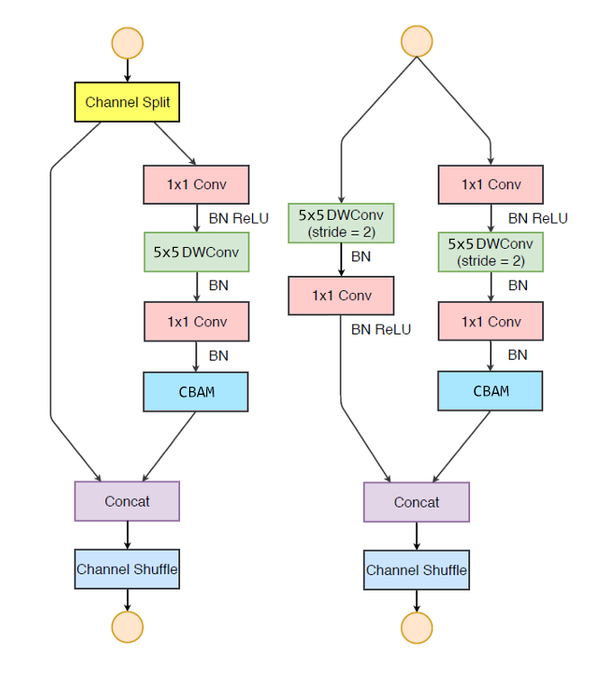

# HYU_Capstone

The goal of this project is to achieve the real-time (high fps) and better IDF1 score on MOT task, and try to deploy on the mobile devices.

In the actual project, it is required to deploy on the devices which the CPU-only environment. Therefore, I decided to design the lightweight real-time single stage multi-object tracking architecture.

The first lightweight architecture that come to mind is shufflenet. It's every common lightweight architecture for mobile devices. Thus, I choose the shufflenet v2 1.5x as backbone because that it could achieve the high accuracy with less operations. In shufflenet, the 5x5 depth-wise convolution obtains twice the receptive field, with only a little  increase in computation over the 3x3 depth-wise convolution. Therefore, I replace all the depth-wise convolutions in ShuffleNetV2 with 5x5 convolutions to get large receptive field.

|  |  |
| :------------------------------------------------------------: | :--------------------------------------------------------: |
| Two 3x3 depth-wise conv with 32 channels                     | Single 5x5 depth-wise conv with 32 channels              |
| $(3\times3\times32+32\times32)\times2=2624$                  | $5\times5\times32+32\times32=1824$                       |

The two basic unit of shufflenet after modification.

The detail of CBAM module is as following.

Comparing with original architecture with modified architecture.

| Layer           | Output size   | Output channels | After modified |
| --------------- | ------------- | --------------- | -------------- |
| Image input     | 640x640       | 3               | 3              |
| Conv1, MaxPool | 320x320, 160x160 | 24              | 24             |
| Stage2          | 80x80         | 176             | 132            |
| Stage3          | 40x40         | 352             | 264            |
| Stage4          | 20x20         | 704             | 528            |

## Shufflenet modification + FPN

I used the modification of shufflenet v2 as backbone to extract feature, connect with the feature map of stage2, stage3, stage4 from backbone as FPN. 

Part of loss function, I referred to SSD loss function which CE loss (Cross Entropy Loss) for the classification and embedding, smooth L1 loss for box regression.

The total track ID of MOT17 dataset is 547, therefore the last full content layer is set to 547 to matching each track ID as each classifiers.

## Backbone(shufflenet) architecture

## Parameters and MAC

| Architecture      | Resolution | Anchors | Parameters (M) | MAC (G) |
| ----------------- | ---------- | ------- |--------------- | ------- |
| RetinaTrack       | 640x640 | 3  | 26.57       | 99.4 |
| RetinaTrack       | 640x640  | 6  | 28.07  | 392.5   |
| ShuffleTrack(our) | 640x640  | 3 | 3.83           | 66.59   |
| ShuffleTrack(our) | 640x640  | 6  | 5.32     | 359.69 |

When numbers of anchor are three, output channels are 128. 

## Results (MOT17)

| Model             |MOTA|TP|FP|IDsw.|mAP|Inference time (ms/frame)|
| ----------------- | ----- | ----- |------| ----- | ----- |---|
| Tracktor          |35.30|106006|15617|16652|36.17|45|
| Tracktor++        |37.94|112801|15642|10370|36.17|2645|
| RetinaTrack       |39.19|112025|11669|5712|38.24|70|
| ShuffleTrack(our) |       |       | | | |20*|

mistake with the dataloader ids and classes

## Demo

## Reference

* [ShuffleNetV2](docs/shuffleNetV2.pdf)
* [RetinaTrack](docs/RetinaTrack.pdf)
* [JDE](Towards Real-Time Multi-Object Tracking)
