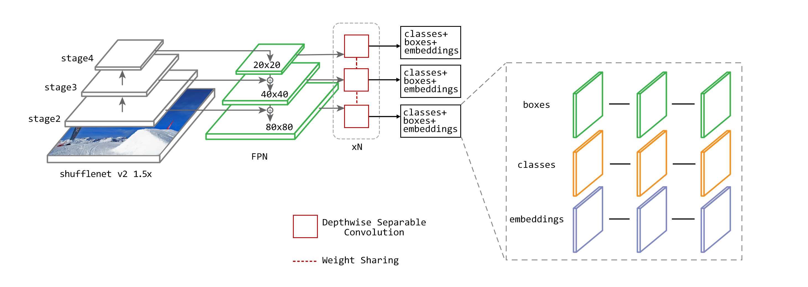

# HYU_Capstone

Our goal is to achieve the real-time (high fps) and better IDF1 score on MOT task, and try to deploy on the mobile devices. 

In the actual project, it is often required to deploy on the devices which the CPU-only environment. Therefore, we decided to design the lightweight real-time multi-object tracking architecture.

The first lightweight architecture that come to mind is shufflenet. It's every common lightweight architecture for mobile devices. Thus, we choose the shufflenet v2 scale 1.5x as backbone.

## Shufflenet v2 1.5x + FPN

We used the shufflenet v2 1.5x as backbone to extract feature, connect with the feature map of stage2, stage3, stage4 from backbone as FPN. 

The loss function we referred to SSD loss function which CE loss (Cross Entropy Loss) for the classification and embedding Loss, smooth L1 loss for box regression.

## Backbone(shufflenet) architecture

## Parameters and MAC

| Architecture      | Resolution | Parameters (M) | MAC (G) |
| ----------------- | ---------- | -------------- | ------- |
| RetinaTrack       | 640x640    | 32.67          | 140.16  |
| ShuffleTrack(our) | 640x640    | 10.31          | 107.74  |

## Results (MOT17)

| Model             |MOTA|TP|FP|IDsw.|mAP|Inference time (ms/frame)|
| ----------------- | ----- | ----- |------| ----- | ----- |---|
| Tracktor          |35.30|106006|15617|16652|36.17|45|
| Tracktor++        |37.94|112801|15642|10370|36.17|2645|
| RetinaTrack       |39.19|112025|11669|5712|38.24|70|
| ShuffleTrack(our) |       |       | | | |20*|

## Demo

## Reference

* [shuffleNetV2](references/shuffleNetV2.pdf)
* 
